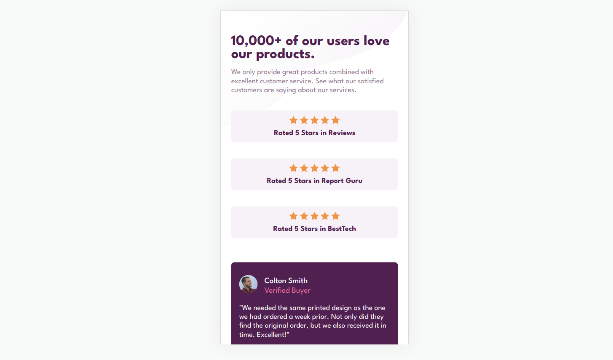

# Frontend Mentor - Social proof section solution
[Live site URL here](https://babar1532.github.io/Social-proof-section/)

This is a solution to the [Frontend Mentor - Social proof section solution on Frontend Mentor](https://www.frontendmentor.io/challenges/social-proof-section-6e0qTv_bA). Frontend Mentor challenges help you improve your coding skills by building realistic projects.

## Table of contents

- [Overview](#overview)
  - [The challenge](#the-challenge)
  - [Screenshot](#screenshot)
  - [Links](#links)
- [My process](#my-process)
  - [Built with](#built-with)
  - [Useful resources](#useful-resources)
- [Author](#author)

## Overview
### The challenge

Users should be able to:

- View the optimal layout for the interface depending on their device's screen size
- See hover and focus states for all interactive elements on the page
### Screenshot

 
### Links

- Solution URL: [Solution URL here](https://github.com/BABAR1532/Social-proof-section)
- Live Site URL: [Live site URL here](https://babar1532.github.io/Social-proof-section/)

## My process

### Built with

- Semantic HTML5 markup
- CSS custom properties
- CSS Grid
- BEM (Block, Element, Modifier) Method
- Flexbox

### Useful resources
- [BEM](https://getbem.com/naming/) - This help me how to use method BEM for naming convention.
- [CSS Grid](https://www.theodinproject.com/lessons/node-path-intermediate-html-and-css-introduction-to-grid) -  This helps me to make responsive layout. 

- [Author](#author)
  - Coded by Ankit Kumar
  - Frontend Mentor profile  [@BABAR1532](https://www.frontendmentor.io/profile/BABAR1532)
